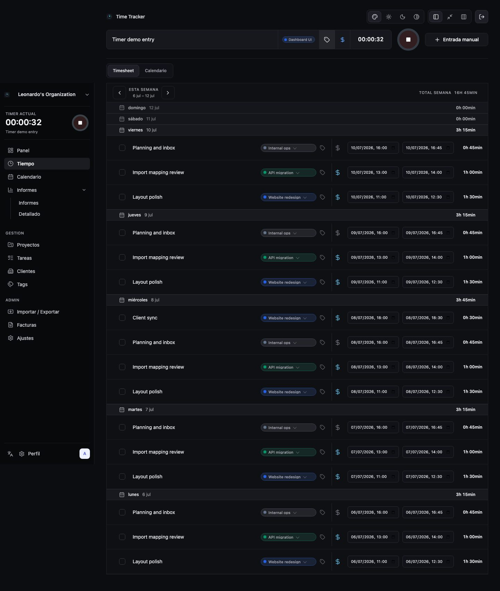
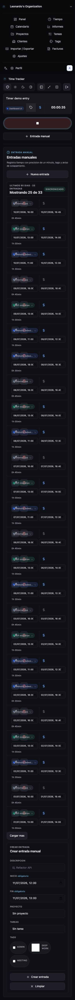

# UI/UX Visual Audit

Audit date: **2026-07-11**

## Scope and method

This audit records the current default Solidtime-like experience before the
experience-theme roadmap changes UI architecture. It uses a fresh SQLite
database, the repository's synthetic seed, the `admin@example.com` development
owner, Spanish UI copy, light browser color preference, and the current default
`solid` layout and theme.

Playwright captured the same eight surfaces at three fixed baselines:

- desktop: `1440x1100`;
- tablet: `834x1112`;
- mobile: `390x844`.

The screenshots cover login, shell/navigation, active timer and quick capture,
manual entry, timesheet, calendar, dashboard, reports, invoices, and
settings/profile. Loading, empty, and error behavior that is not present in the
seeded screenshots was checked against `App`, `QueryErrorBanner`, and the
surface components. This is an audit, not a pixel-diff regression suite.

## Evidence matrix

| Surface | Desktop | Tablet | Mobile |
| --- | --- | --- | --- |
| Login | [1440](assets/ui-audit/2026-07-11/desktop-1440/login.jpg) | [834](assets/ui-audit/2026-07-11/tablet-834/login.jpg) | [390](assets/ui-audit/2026-07-11/mobile-390/login.jpg) |
| Timesheet + timer | [1440](assets/ui-audit/2026-07-11/desktop-1440/timesheet.jpg) | [834](assets/ui-audit/2026-07-11/tablet-834/timesheet.jpg) | [390](assets/ui-audit/2026-07-11/mobile-390/timesheet.jpg) |
| Manual entry | [1440](assets/ui-audit/2026-07-11/desktop-1440/manual-entry.jpg) | [834](assets/ui-audit/2026-07-11/tablet-834/manual-entry.jpg) | [390](assets/ui-audit/2026-07-11/mobile-390/manual-entry.jpg) |
| Calendar | [1440](assets/ui-audit/2026-07-11/desktop-1440/calendar.jpg) | [834](assets/ui-audit/2026-07-11/tablet-834/calendar.jpg) | [390](assets/ui-audit/2026-07-11/mobile-390/calendar.jpg) |
| Dashboard | [1440](assets/ui-audit/2026-07-11/desktop-1440/dashboard.jpg) | [834](assets/ui-audit/2026-07-11/tablet-834/dashboard.jpg) | [390](assets/ui-audit/2026-07-11/mobile-390/dashboard.jpg) |
| Reports | [1440](assets/ui-audit/2026-07-11/desktop-1440/reports.jpg) | [834](assets/ui-audit/2026-07-11/tablet-834/reports.jpg) | [390](assets/ui-audit/2026-07-11/mobile-390/reports.jpg) |
| Invoices | [1440](assets/ui-audit/2026-07-11/desktop-1440/invoices.jpg) | [834](assets/ui-audit/2026-07-11/tablet-834/invoices.jpg) | [390](assets/ui-audit/2026-07-11/mobile-390/invoices.jpg) |
| Settings/profile | [1440](assets/ui-audit/2026-07-11/desktop-1440/settings-profile.jpg) | [834](assets/ui-audit/2026-07-11/tablet-834/settings-profile.jpg) | [390](assets/ui-audit/2026-07-11/mobile-390/settings-profile.jpg) |

Representative desktop evidence:

Representative mobile evidence:

## Priority model

- **P0:** a workflow is blocked or content is inaccessible.
- **P1:** high-frequency friction or a serious responsive/accessibility issue.
- **P2:** polish, density, hierarchy, or consistency issue.

No P0 issue was observed: the audited routes load and their primary controls
remain reachable at every baseline.

## Findings

| ID | Priority | Surface/viewports | Observation | User impact | Evidence | Target sprint |
| --- | --- | --- | --- | --- | --- | --- |
| UXA-001 | P1 | Shell, tablet/mobile | Below `980px` the complete sidebar becomes a 4-column or 2-column navigation grid above every page. On mobile it consumes roughly the first quarter of the viewport before the current task appears. | Every route change and daily timer interaction pays the same navigation tax; the hierarchy between daily work, management, and administration disappears. | [Tablet timesheet](assets/ui-audit/2026-07-11/tablet-834/timesheet.jpg), [mobile timesheet](assets/ui-audit/2026-07-11/mobile-390/timesheet.jpg), `.sidebar-nav` media rules in `styles.css` | Sprint 4 |
| UXA-002 | P1 | Manual entry, tablet/mobile | At widths below `1180px`, `clients-workbench` stacks the editor after the full directory. The seeded page is `6062px` tall on tablet and `5153px` on mobile; **Nueva entrada** resets the form but does not scroll to it. | Creating a manual entry from the top requires traversing the entire recent-entry directory, turning a core capture flow into a long-scroll task. | [Tablet](assets/ui-audit/2026-07-11/tablet-834/manual-entry.jpg), [mobile](assets/ui-audit/2026-07-11/mobile-390/manual-entry.jpg), `ManualTimeEntryPanel` | Sprint 5 |
| UXA-003 | P1 | Dashboard, tablet | The `834px` baseline produces an `849px` full-page screenshot. The three-column top grid remains active until `760px`, and the right calendar navigation is visibly clipped. | Tablet users get horizontal scrolling and partially hidden controls on a primary overview. | [Tablet dashboard](assets/ui-audit/2026-07-11/tablet-834/dashboard.jpg), `.dashboard-top-grid` | Sprint 7 |
| UXA-004 | P1 | Timesheet, mobile | A single seeded week expands to `4056px`. Every entry repeats description, project, two date/time controls, flags, and duration in the default scanning view. | Reviewing a week is slow and visually noisy; inline editing controls compete with the primary task of reading totals and spotting anomalies. | [Mobile timesheet](assets/ui-audit/2026-07-11/mobile-390/timesheet.jpg), `.time-entry-row` mobile grid | Sprint 6 |
| UXA-005 | P1 | Shell toolbar, tablet/mobile | Theme, mode, layout, and logout remain as dense icon-only groups on every route. Toolbar buttons are `38px` wide while mobile touch guidance normally needs a larger target, and selection meaning relies on icon recognition/title text. | Frequently used content loses space to low-frequency appearance controls, and touch/recognition cost is unnecessarily high. | [Tablet calendar](assets/ui-audit/2026-07-11/tablet-834/calendar.jpg), [mobile reports](assets/ui-audit/2026-07-11/mobile-390/reports.jpg), `.toolbar > button` | Sprints 3–4 |
| UXA-006 | P2 | Settings/profile, mobile | Account data, app preferences, email notifications, password, S3 credentials, backup execution, and restore are one `3744px` document with no local section navigation. | Safe operational controls are hard to relocate and the common profile task is visually coupled to rare maintenance work. | [Mobile settings](assets/ui-audit/2026-07-11/mobile-390/settings-profile.jpg), `ProfileSettingsPanel` + `BackupSettingsPanel` | Sprints 3–4 |
| UXA-007 | P2 | Manual entry, desktop | The side-by-side workbench keeps the editor at the top while the 25-entry directory makes the page `4280px` tall, leaving a large unused column below the form. | The desktop layout is functional but wastes space and loses form context while the directory continues far below it. | [Desktop manual entry](assets/ui-audit/2026-07-11/desktop-1440/manual-entry.jpg), `.clients-workbench` | Sprint 5 |
| UXA-008 | P2 | Reports/invoices, all | Both screens start with configuration forms followed by large low-information empty regions. The report requires **Actualizar vista** before content appears, while invoices mix draft configuration and the empty directory in one panel. | First-use intent is understandable only after reading helper copy; preview/result hierarchy is weak compared with daily tracking screens. | [Desktop reports](assets/ui-audit/2026-07-11/desktop-1440/reports.jpg), [desktop invoices](assets/ui-audit/2026-07-11/desktop-1440/invoices.jpg), [mobile reports](assets/ui-audit/2026-07-11/mobile-390/reports.jpg) | Sprint 8 |
| UXA-009 | P2 | Login, desktop | The login workbench is clear and keyboard-friendly, but occupies a very small island in a large undifferentiated canvas and offers little product context beyond the title. | The entry screen feels like a scaffold even though authentication itself is usable. | [Desktop login](assets/ui-audit/2026-07-11/desktop-1440/login.jpg) | Sprint 9 |
| UXA-010 | P2 | Empty/loading/error states, all | Lists use `QueryErrorBanner` with retry, boot has a separate full-screen state, and reports/invoices/dashboard use their own loading or empty treatments. The states work but lack a shared visual hierarchy and spacing contract. | Recovery remains possible, but feedback shifts style and prominence between surfaces, weakening predictability. | `App`, `QueryErrorBanner`, `DashboardPanel`, `TimeReportPanel`, `InvoicePanel`; [desktop dashboard](assets/ui-audit/2026-07-11/desktop-1440/dashboard.jpg) | Sprints 7–10 |

## Cross-cutting themes

### Navigation and responsive shell

The desktop sidebar is stable and keeps the current timer visible. Its tablet and
mobile transformation preserves reachability but flattens all destinations into
one large header. Sprint 4 should restore hierarchy and keep daily capture closer
than administration without changing hash routes.

### Density and information hierarchy

Desktop density generally supports scanning. The same structures are stacked
verbatim on smaller screens, producing very long documents in timesheet, manual
entry, and settings. Responsive work should choose what is summary, what is
editable inline, and what opens on demand rather than only changing columns.

### Forms, tables, and primary actions

Timer start/stop remains visually prominent. Manual entry, reports, and invoices
do not consistently keep their primary form/action adjacent to the context that
drives it. The redesign should preserve explicit Go/API behavior while giving
each surface one dominant next action.

### System states and accessibility

Current empty and error states are functional, and destructive controls already
use explicit confirmation. The next visual layers need shared semantic tokens
for status, focus, error, warning, and disabled states. Touch targets and icon
meaning need explicit contracts before the shell is reorganized.

## Sprint 2 input

Sprint 2 should create only the foundation needed by the later fixes:

1. Define `data-theme`, `data-layout`, `data-nav`, and `data-preset` on the root
   element, with `custom` when individual controls diverge from a preset.
2. Preserve `leotime.theme`, `leotime.layout`, and profile hydration while the
   new experience state is introduced.
3. Establish foundation and semantic tokens for surfaces, text, borders,
   focus, status, spacing, radius, and minimum interactive target size.
4. Add tests for attribute hydration, legacy preference compatibility, and
   preset-to-custom transitions.
5. Do not fix UXA-001 through UXA-010 in Sprint 2; route their component and
   layout changes to the target sprints in the findings table.

## Verification

The deterministic audit runner uses separate ports and a fresh temporary
database, then authenticates once per viewport to respect the production login
rate limit.

| Command | Result |
| --- | --- |
| `npm --workspace @leotime/web run build` | Pass; Vite production build completed. |
| `npm --workspace @leotime/web run test:e2e:audit -- --list` | Pass; 6 tests across 3 viewport projects. |
| `npm --workspace @leotime/web run test:e2e` | Pass; the existing Chromium smoke remains isolated and completed 1 test in 0.9s. |
| `npm --workspace @leotime/web run test:e2e:audit` | Pass; 6 tests and 24 screenshots in 6.9s. |
| `sips -g pixelWidth -g pixelHeight docs/assets/ui-audit/2026-07-11/*/*.jpg` | Pass; 8 images per viewport, with tablet dashboard overflow recorded as UXA-003. |
| `make pre-commit` | Pass; gofmt, Go vet/tests, 16 frontend files with 79 tests, and the production build. |
| `make smoke BASE_URL=http://127.0.0.1:18080` | Pass against the production build served by a temporary local API instance. |
